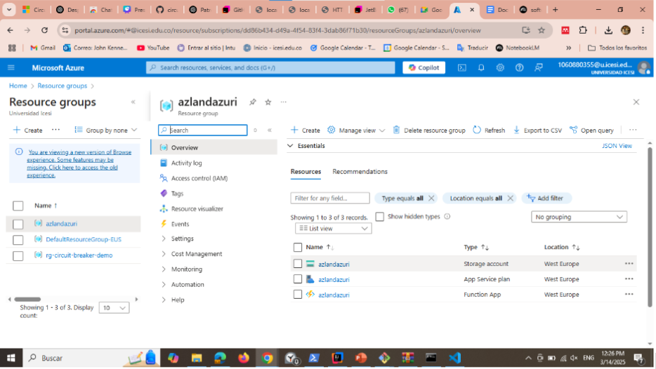
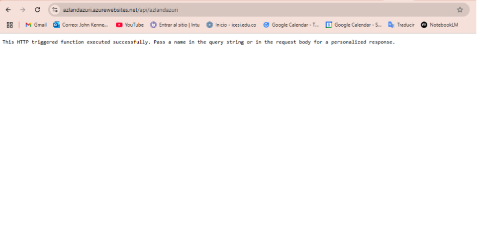
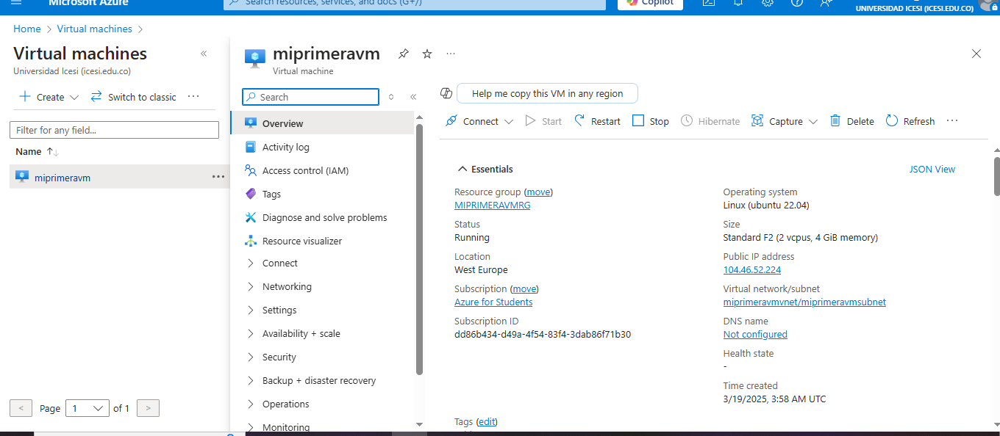
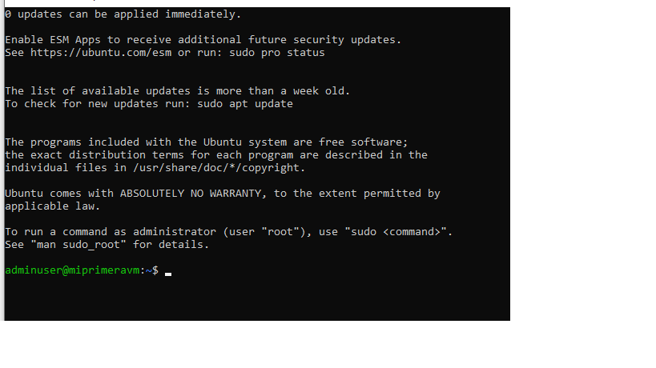

# Terraform Basics with Azure

## Introducción
Este taller guía a los participantes a través del despliegue de una Azure Function App y una máquina virtual Linux utilizando Terraform en Microsoft Azure. 

## Prerrequisitos

Antes de comenzar, asegúrate de cumplir con los siguientes requisitos:

- Tener una cuenta de Microsoft Azure con permisos adecuados.
- Instalar [Azure CLI](https://docs.microsoft.com/en-us/cli/azure/install-azure-cli) y autenticarse con `az login`.
- Instalar [Terraform](https://www.terraform.io/downloads).
- Configurar correctamente las credenciales de Azure para Terraform.

## Configuración del Entorno

Sigue estos pasos para configurar tu entorno desde cero:

1. **Instalar Azure CLI**
   - Descarga e instala Azure CLI desde [aquí](https://docs.microsoft.com/en-us/cli/azure/install-azure-cli).
   - Verifica la instalación ejecutando:
     ```sh
     az --version
     ```
   - Inicia sesión en tu cuenta de Azure:
     ```sh
     az login
     ```

2. **Instalar Terraform**
   - Descarga e instala Terraform desde [aquí](https://www.terraform.io/downloads).
   - Verifica la instalación ejecutando:
     ```sh
     terraform version
     ```

3. **Configurar credenciales de Azure para Terraform**
   - Crea un servicio principal en Azure para autenticación con Terraform:
     ```sh
     az ad sp create-for-rbac --role="Contributor" --scopes="/subscriptions/<your-subscription-id>"
     ```
   - Guarda el `appId`, `password` y `tenant` proporcionados para configurar Terraform.

## Estructura del Proyecto

El código de Terraform se encuentra en las carpetas `azure-functions/` y `azure-vm/`. Contiene los siguientes archivos:

```bash
azure-functions/
├── main.tf         # Configuración principal de la Function App
├── variables.tf    # Definición de variables
├── outputs.tf      # Definición de outputs
├── providers.tf    # Configuración del proveedor de Azure

azure-vm/
├── main.tf         # Configuración principal de la máquina virtual
```

## Despliegue de la Azure Function App

Sigue estos pasos para desplegar la Function App en Azure:

1. **Clonar el repositorio y acceder a la carpeta correspondiente**
   ```sh
   git clone <repositorio>
   cd terraform-workshop1/azure-functions
   ```

2. **Inicializar Terraform** para descargar los proveedores necesarios:
   ```sh
   terraform init
   ```

3. **Visualizar el plan de ejecución** para ver los recursos que se crearán:
   ```sh
   terraform plan
   ```

4. **Aplicar la configuración** para desplegar la Function App:
   ```sh
   terraform apply -auto-approve
   ```

5. **Obtener la URL de la Function App** después del despliegue:
   ```sh
   terraform output function_app_url
   ```


# Terraform Basics with Azure

## Introducción
Este taller guía a los participantes a través del despliegue de una Azure Function App y una máquina virtual Linux utilizando Terraform en Microsoft Azure. 

## Prerrequisitos

Antes de comenzar, asegúrate de cumplir con los siguientes requisitos:

- Tener una cuenta de Microsoft Azure con permisos adecuados.
- Instalar [Azure CLI](https://docs.microsoft.com/en-us/cli/azure/install-azure-cli) y autenticarse con `az login`.
- Instalar [Terraform](https://www.terraform.io/downloads).
- Configurar correctamente las credenciales de Azure para Terraform.


  


## Despliegue de la Azure Function App


1. **Inicializar Terraform** para descargar los proveedores necesarios:
   ```sh
   terraform init
   ```

2. **Visualizar el plan de ejecución** para ver los recursos que se crearán:
   ```sh
   terraform plan
   ```

3. **Aplicar la configuración** para desplegar la Function App:
   ```sh
   terraform apply 
   ```


4. **Obtener la dirección IP pública de la máquina virtual** después del despliegue:
   ```sh
   terraform output public_ip
   ```

5. **Conectarse a la máquina virtual vía SSH**
   ```sh
   ssh <admin_username>@<public-ip>
   ```



## Limpieza de Recursos

Para eliminar los recursos creados y evitar costos adicionales:
```sh
terraform destroy 
```


